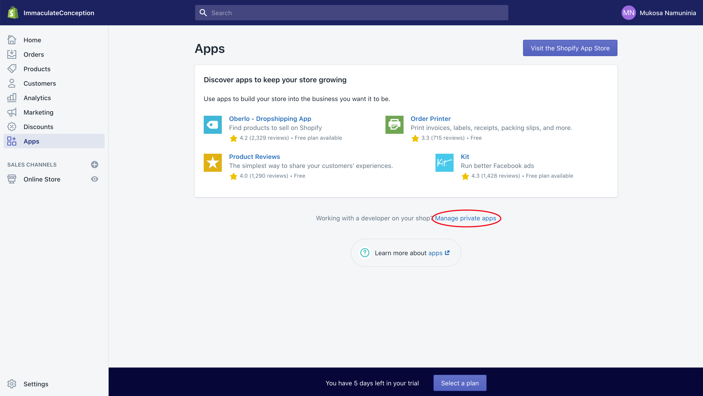
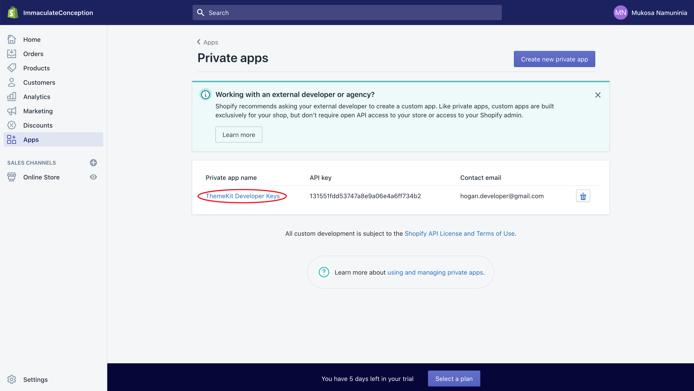
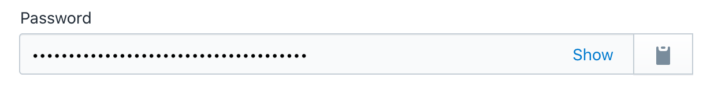

# immaculate-conception

Theme code for immaculate conception website.

<!-- START doctoc generated TOC please keep comment here to allow auto update -->
<!-- DON'T EDIT THIS SECTION, INSTEAD RE-RUN doctoc TO UPDATE -->
**Table of Contents**

- [Setup](#setup)
  - [Accounts](#accounts)
  - [](#)
- [Contributing](#contributing)
- [Deploying](#deploying)

<!-- END doctoc generated TOC please keep comment here to allow auto update -->

## Setup

This code leverages Shopify [ThemeKit](https://shopify.github.io/themekit/) to push changes to a remote Shopify theme. It is a customized version of the popular [Debut](https://themes.shopify.com/themes/debut/styles/default) theme on Shopify. You will need to setup the following accounts, install the following system tools, and follow these instructions to begin development:

### Accounts

1. Shopify -  You will need to be invited as a collaborator on the Immaculate Conception Shopify Store. You may use the [single sign on](https://help.shopify.com/en/manual/your-account/logging-in/sso-migration-guide) feature to create your account, but make sure that you have access to the email associated with your account as you may need to email yourself theme code or data exports during development.

2. Github - You will need a personal github account and will additionally need to be invited as a [collaborator](https://github.com/HoganMcDonald/immaculate-conception) on the project.

### Dependencies

- [HomeBrew](https://brew.sh/)

- [Themekit](https://shopify.github.io/themekit/):

    ```bash
    brew tap shopify/shopify
    brew install themekit
    ```

- [Node](https://github.com/nvm-sh/nvm):

    ```bash
    brew install nvm
    nvm use

    # you may be required to first install the node version found int he .nvmrc
    ```

- [Yarn](https://yarnpkg.com/):
    ```bash
    npm install -g yarn
    ```

### Installation

1. Clone this repo.

2. Create a development theme for your own personal use on the themes tab in Shopify.

3. Copy `config.yml` file and fill in values with Shopify private app values.

    ```bash
    cp template.config.yml config.yml
    ```

    The value for `password` can be found in the apps section of Shopify Admin.

    1. 
    2. 
    3. 

    The value for `theme_id` will be unique for each developer. You should have already created a development theme. Use this command to retrieve the theme id and then copy it into your config file. **DO NOT SET YOUR THEME_ID TO THE THEME MARKED "live"**

    ```bash
    yarn theme:list
    ```

## Contributing

This code is hosted on [Github](https://github.com/HoganMcDonald/immaculate-conception). You must be invited as a collaborator to make contributions. Currently, merging of pull requests requires approval from the repository owner. No other CI/CD pipeline is required by merging.

## Deploying
